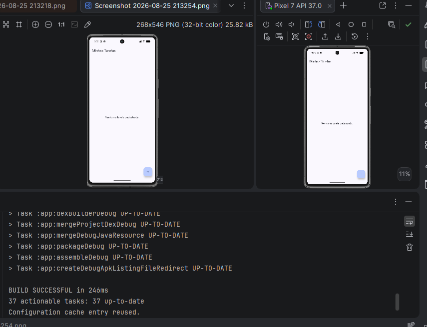

# To-Do List — Atividade Individual (Android Development / FIAP)

## Descrição do projeto

Aplicativo Android de lista de tarefas (To-Do List) desenvolvido como atividade individual da disciplina de Android Development da FIAP. O objetivo da aplicação é permitir que o usuário **liste, crie, edite, conclua e exclua tarefas**, com persistência local dos dados e navegação entre a tela de listagem e o formulário de cadastro/edição.

A atividade consistiu em evoluir um projeto-base fornecido pelo professor, implementando a camada de apresentação (UI), a camada de ViewModel e a navegação entre telas, integrando tudo com a camada de dados já existente (Room).

## Tecnologias utilizadas

- **Kotlin** — linguagem principal do projeto
- **Jetpack Compose** — construção declarativa da interface
- **Room** — persistência local dos dados (banco SQLite abstraído)
- **Coroutines / Flow** — operações assíncronas e observação reativa dos dados
- **ViewModel** (`androidx.lifecycle`) — gerenciamento de estado da UI
- **Navigation Compose** — navegação entre as telas do app

## Arquitetura da aplicação

O projeto segue uma separação em camadas: **Data → Repository → ViewModel → UI → Navigation**.

### `TarefaRepository`

Fica em `repository/TarefaRepositoy.kt`. É a camada responsável por abstrair o acesso aos dados: expõe um `Flow<List<Tarefa>>` vindo do `TarefaDao` e disponibiliza as operações suspensas de `inserir`, `atualizar` e `deletar`. A ViewModel não conhece o `TarefaDao` diretamente — ela conversa só com o Repository, o que isola a camada de dados do restante da aplicação.

### `TarefaViewModel`

Fica em `viewmodel/TarefaViewModel.kt`. É responsável por manter o estado da lista de tarefas como um `StateFlow<List<Tarefa>>`, convertendo o `Flow` do Repository com `stateIn` (compartilhado entre observadores, com timeout de 5 segundos após perder todos os coletores). Expõe as funções `inserir`, `atualizar` e `deletar`, cada uma disparando uma coroutine em `viewModelScope`. Também define uma `Factory` (`TarefaViewModel.factory(context)`) que instancia o `TarefaRepository` a partir do `TarefaDatabase`, permitindo que a `MainActivity` crie a ViewModel corretamente via `viewModel(factory = ...)`.

### `ListaTarefasScreen`

Fica em `ui/ListaTarefasScreen.kt`. Observa o estado `tarefas` da ViewModel com `collectAsStateWithLifecycle()` e repassa para o `ListaTarefasContent`, que exibe a lista em uma `LazyColumn`. Cada item (`TarefaItem`) tem um `Checkbox` para marcar/desmarcar como concluída (disparando `viewModel.atualizar`), um botão de exclusão (disparando `viewModel.deletar`) e é clicável para abrir a edição (`onEditarTarefa`). Um `FloatingActionButton` aciona `onNovaTarefa` para abrir o formulário de cadastro. A tela trata o caso de lista vazia exibindo uma mensagem, e conta com `@Preview`s tanto para o estado com tarefas quanto vazio.

### `FormularioTarefaScreen`

Fica em `ui/FormularioTarefaScreen.kt`. Atende tanto o cadastro quanto a edição de tarefas a partir de um único componente. Recebe o `tarefaId`: quando é `0`, está em modo de criação; quando é diferente de `0`, busca a tarefa correspondente na lista observada da ViewModel e pré-preenche os campos de título e descrição. Ao salvar, decide entre `viewModel.inserir` (nova tarefa) ou `viewModel.atualizar` (edição), e retorna para a tela anterior via `onVoltar`. Conta com `@Preview`s para os dois modos (nova tarefa e edição).

### `AppNavigation`

Fica em `navigation/AppNavigation.kt`. Define um `NavHost` com duas rotas:
- `"lista"` — tela inicial, renderiza `ListaTarefasScreen`
- `"formulario/{tarefaId}"` — renderiza `FormularioTarefaScreen`, recebendo o `tarefaId` como argumento de navegação

A navegação para o formulário de nova tarefa usa `"formulario/0"`, enquanto a edição usa `"formulario/$id"` com o ID real da tarefa. Dentro do formulário, o argumento é lido de `backStackEntry.arguments` e convertido para `Int`.

### `MainActivity`

Fica na raiz do pacote (`MainActivity.kt`). Substitui o conteúdo padrão gerado pelo template do Android Studio: dentro do `setContent`, cria a `TarefaViewModel` usando `viewModel(factory = TarefaViewModel.factory(applicationContext))` e passa essa instância para o `AppNavigation`, que assume o controle total da navegação do app a partir da tela de listagem.

## Como executar o projeto

1. Clone este repositório.
2. Abra a pasta do projeto no Android Studio.
3. Aguarde a sincronização do Gradle (as dependências de Room, Navigation Compose e Compose BOM já estão configuradas em `libs.versions.toml` e `app/build.gradle.kts`).
4. Rode o app em um emulador ou dispositivo físico com Android 7.0 (API 24) ou superior.
5. Ao abrir, o app exibe a lista de tarefas (vazia na primeira execução). Use o botão flutuante (+) para cadastrar a primeira tarefa.

## Evidências

### Tela inicial com a lista de tarefas

### Cadastro de uma nova tarefa

### Tarefa cadastrada aparecendo na lista

### Edição de uma tarefa existente

### Tarefa marcada como concluída

### Exclusão de uma tarefa

### Navegação entre lista e formulário

### Build/execução sem erros
